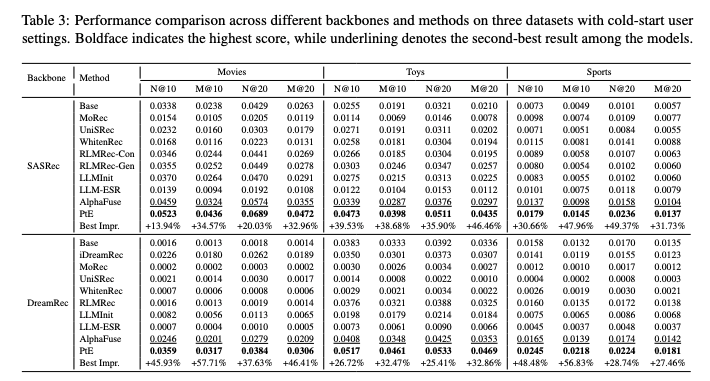
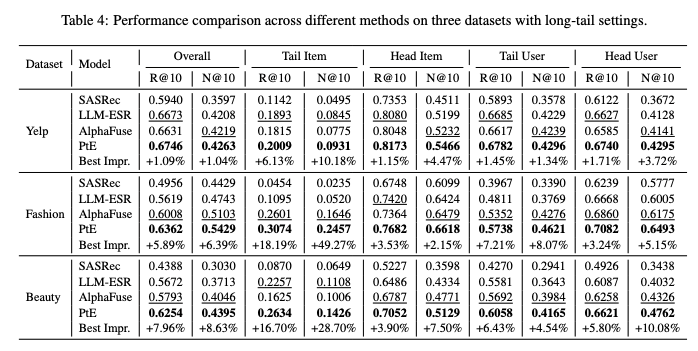

# From ID to LLM: Rethinking Representation Learning for Recommendation

This repository contains the **codebase and datasets** for the paper:

> **From ID to LLM: Rethinking Representation Learning for Recommendation**

---

## 📌 Introduction

Recent studies suggest a fundamental incompatibility between **ID-based representations** and **language model (LM) representations** in recommender systems.  
ID representations primarily encode **collaborative behavioral signals**, whereas LM representations capture **semantic information**.  
As a result, LM-based representations often underperform traditional ID embeddings in recommendation tasks.

In this work, we revisit this problem from an **information-theoretic perspective** and show that **LLM representations theoretically subsume all discriminative information contained in ID embeddings**.  
Based on this observation, we propose **Profile-then-Embedding (PtE)**, a two-stage framework for recommendation:

- **Profile Stage**:  
  Semantic user and item profiles are jointly generated through **LLM-based bidirectional reasoning** over user–item interaction histories.

- **Personalized Embedding Stage**:  
  The generated profiles are encoded into **task-aligned recommendation embeddings**, optimized for downstream recommendation objectives.

Extensive experiments on multiple benchmark datasets demonstrate that PtE consistently improves performance under **cold-start** and **long-tail** settings, across both **discriminative** and **generative** recommendation models.


---

## 📝 Environment

### Base Recommendation Models

- `python==3.9.13`
- `numpy==1.23.1`
- `torch==1.11.0`
- `scipy==1.9.1`

### LLM Fine-tuning and Alignment

- `wandb==0.16.2`
- `transformers==4.36.2`
- `trl==0.7.9`
- `peft==0.7.2`

---

## 🚀 How to Run

### 1. LLM Fine-tuning with LoRA

```bash
cd ./llm/lora/
```

#### (a) Supervised Fine-tuning Loop Procedure Repeat until convergence:
We adopt an iterative collaborative fine-tuning strategy. 
Starting from a base LLM, we alternately perform user-side and item-side LoRA-based instruction tuning. 
At each iteration, the model is initialized with the LoRA parameters obtained from the previous stage. This process is repeated until convergence.

```bash
python loop_lora_train.py
```


#### (c) Reinforcement Learning for Personalized Feature Enhancement

```bash
cd ./rlhf/
```

* GRPO Optimization :

```bash
python rl_training.py
```


---

### 2. User / Item Profile Generation

* **User profile generation (knowledge distillation only)**:

```bash
python inference_base.py
```

* **User profile generation (instruction tuning + RL enhancement)**:

```bash
python inference_base_mask.py
```

* **Item profile generation**:

```bash
python inference_base_item.py
```

---

### 3. Running Recommendation Models with Generated Profiles

Example: running **BiasMF** with generated user/item profiles:

```bash
cd ./base_models/BiasMF/
python Main.py --data {dataset}
```

---

## 🎯 Experimental Results

**Performance comparison in terms of *Recall* and *NDCG***:

### Cold-Start Setting


### Long-Tail Setting


---

## 📚 Datasets

### Dataset Statistics

| Statistics       | MIND    | Netflix   | Industrial |
| ---------------- | ------- | --------- | ---------- |
| # Users          | 57,128  | 16,835    | 117,433    |
| # Overlap Items  | 1,020   | 6,232     | 72,417     |
| # Snapshot       | Daily   | Yearly    | Daily      |
| **Training Set** |         |           |            |
| # Items          | 2,386   | 6,532     | 152,069    |
| # Interactions   | 89,734  | 1,655,395 | 858,087    |
| # Sparsity       | 99.934% | 98.495%   | 99.995%    |
| **Test Set**     |         |           |            |
| # Items          | 2,461   | 8,413     | 158,155    |
| # Interactions   | 87,974  | 1,307,051 | 876,415    |
| # Sparsity       | 99.937% | 99.077%   | 99.995%    |

---

## 📎 Notes

* This repository focuses on **representation learning**, rather than prompt-based generation.
* Profile generation and embedding learning are **decoupled by design**, enabling stable integration with both discriminative and generative recommenders.
* Code is organized to facilitate reproducibility and extension.

```


