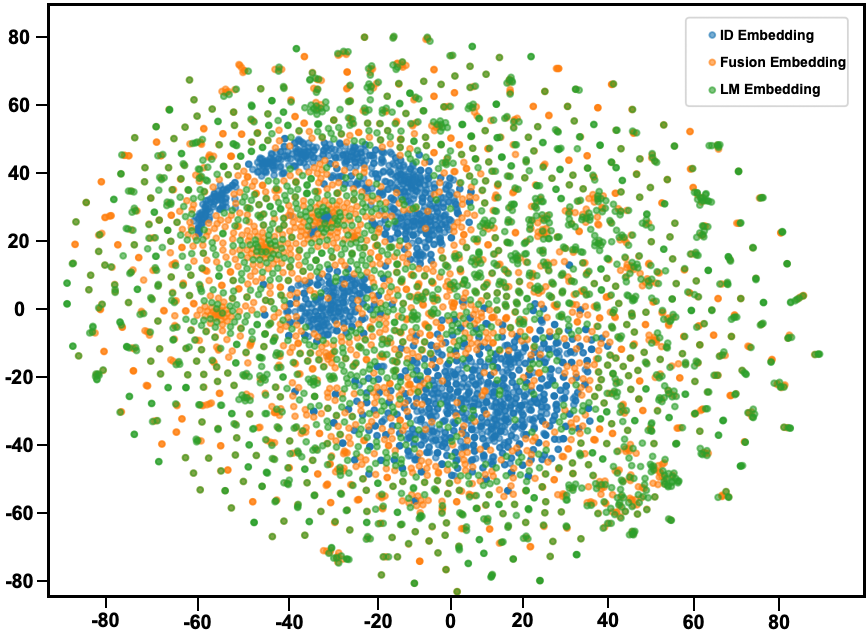

# From ID to LLM: Rethinking Representation Learning for Recommendation

This repository contains the **codebase and datasets** for the paper:

> **From ID to LLM: Rethinking Representation Learning for Recommendation**

---

## 📌 Introduction

Recent studies suggest a fundamental incompatibility between **ID-based representations** and **language model (LM) representations** in recommender systems.  
ID representations primarily encode **collaborative behavioral signals**, whereas LM representations capture **semantic information**.  
As a result, LM-based representations often underperform traditional ID embeddings in recommendation tasks.

In this work, we revisit this problem from an **information-theoretic perspective** and show that **LLM representations theoretically subsume all discriminative information contained in ID embeddings**.  
Based on this observation, we propose **Profile-then-Embedding (PtE)**, a two-stage framework for recommendation:

- **Profile Stage**:  
  Semantic user and item profiles are jointly generated through **LLM-based bidirectional reasoning** over user–item interaction histories.

- **Personalized Embedding Stage**:  
  The generated profiles are encoded into **task-aligned recommendation embeddings**, optimized for downstream recommendation objectives.

Extensive experiments on multiple benchmark datasets demonstrate that PtE consistently improves performance under **cold-start** and **long-tail** settings, across both **discriminative** and **generative** recommendation models.



---

## 📝 Environment

### Base Recommendation Models

- `python==3.9.13`
- `numpy==1.23.1`
- `torch==1.11.0`
- `scipy==1.9.1`

### LLM Fine-tuning and Alignment

- `wandb==0.16.2`
- `transformers==4.36.2`
- `trl==0.7.9`
- `peft==0.7.2`

---

## 🚀 How to Run

### 1. LLM Fine-tuning with LoRA

```bash
cd ./llm/lora/
````

#### (a) Supervised Fine-tuning via Knowledge Distillation (User Side)

```bash
python sft_base.py
```

#### (b) Collaborative Instruction Tuning (User Side)

```bash
python sft_base_mask.py
```

#### (c) Reinforcement Learning for Personalized Feature Enhancement (User Side)

```bash
cd ./rlhf/
```


* GRPO Optimization :

```bash
python rl_training.py
```

#### (d) Collaborative Instruction Tuning (Item Side)

```bash
python sft_base_item.py
```

---

### 2. User / Item Profile Generation

* **User profile generation (knowledge distillation only)**:

```bash
python inference_base.py
```

* **User profile generation (instruction tuning + RL enhancement)**:

```bash
python inference_base_mask.py
```

* **Item profile generation**:

```bash
python inference_base_item.py
```

---

### 3. Running Recommendation Models with Generated Profiles

Example: running **BiasMF** with generated user/item profiles:

```bash
cd ./base_models/BiasMF/
python Main.py --data {dataset}
```

---

## 🎯 Experimental Results

**Performance comparison in terms of *Recall* and *NDCG***:

### Cold-Start Setting

\begin{table*}[htbp]
  \centering
  \caption{Performance comparison across different backbones and methods on three datasets with cold-start user settings. Boldface indicates the highest score, while underlining denotes the second-best result among the models.}
  \label{sota}
\resizebox{\linewidth}{!}{%
    \begin{tabular}{l| l| *{4}{c}| *{4}{c} |*{4}{c}}
      \toprule
      \multirow{2}{*}{Backbone} & \multirow{2}{*}{Method} & \multicolumn{4}{c|}{Movies} & \multicolumn{4}{c|}{Toys} & \multicolumn{4}{c}{Sports} \\
      \cmidrule{3-14} 
      & & N@10 & M@10 & N@20 & M@20 & N@10 & M@10 & N@20 & M@20 & N@10 & M@10 & N@20 & M@20 \\
      \midrule
      \multirow{11}{*}{SASRec} 
        & Base        & 0.0338 & 0.0238 & 0.0429 & 0.0263 & 0.0255 & 0.0191 & 0.0321 & 0.0210 & 0.0073 & 0.0049 & 0.0101 & 0.0057 \\
        & MoRec       & 0.0154 & 0.0105 & 0.0205 & 0.0119 & 0.0114 & 0.0069 & 0.0146 & 0.0078 & 0.0098 & 0.0074 & 0.0109 & 0.0077 \\
        & UniSRec     & 0.0232 & 0.0160 & 0.0303 & 0.0179 & 0.0271 & 0.0191 & 0.0311 & 0.0202 & 0.0071 & 0.0051 & 0.0084 & 0.0055 \\
        & WhitenRec   & 0.0168 & 0.0116 & 0.0223 & 0.0131 & 0.0258 & 0.0181 & 0.0304 & 0.0194 & 0.0115 & 0.0081 & 0.0141 & 0.0088 \\
        & RLMRec-Con  & 0.0346 & 0.0244 & 0.0441 & 0.0269 & 0.0266 & 0.0185 & 0.0304 & 0.0195 & 0.0089 & 0.0058 & 0.0107 & 0.0063 \\
        & RLMRec-Gen  & 0.0355 & 0.0252 & 0.0449 & 0.0278 & 0.0303 & 0.0246 & 0.0347 & 0.0257 & 0.0080 & 0.0054 & 0.0102 & 0.0060 \\
        & LLMInit     &0.0370 & 0.0264 & 0.0470 &0.0291 & 0.0275 & 0.0215 & 0.0313 & 0.0225 & 0.0083 & 0.0055 & 0.0102 & 0.0060 \\
        & LLM-ESR     & 0.0139 & 0.0094 & 0.0192 & 0.0108 & 0.0122 & 0.0104 & 0.0153 & 0.0112 & 0.0101 & 0.0075 & 0.0118 & 0.0079 \\
        & AlphaFuse   & \underline{0.0459} & \underline{0.0324} & \underline{0.0574} & \underline{0.0355} & \underline{0.0339} & \underline{0.0287} & \underline{0.0376} & \underline{0.0297} & \underline{0.0137} & \underline{0.0098} & \underline{0.0158} & \underline{0.0104} \\
        & PtE   & \textbf{0.0523} & \textbf{0.0436} & \textbf{0.0689} & \textbf{0.0472} & \textbf{0.0473} & \textbf{0.0398} & \textbf{0.0511} & \textbf{0.0435} & \textbf{0.0179} & \textbf{0.0145} & \textbf{0.0236} & \textbf{0.0137} \\
        & Best Impr.  & +13.94\% & +34.57\% & +20.03\% & +32.96\% & +39.53\% & +38.68\% & +35.90\% & +46.46\% & +30.66\% & +47.96\% & +49.37\% & +31.73\% \\
      \midrule
      \multirow{11}{*}{DreamRec} 
        & Base        & 0.0016 & 0.0013 & 0.0018 & 0.0014 & 0.0383 & 0.0333 & 0.0392 & 0.0336 & 0.0158 & 0.0132 & 0.0170 & 0.0135 \\
        & iDreamRec   & 0.0226 & 0.0180 & 0.0262 & 0.0189 & 0.0350 & 0.0301 & 0.0373 & 0.0307 & 0.0141 & 0.0119 & 0.0155 & 0.0123 \\
        & MoRec       & 0.0002 & 0.0002 & 0.0003 & 0.0002 & 0.0030 & 0.0026 & 0.0034 & 0.0027 & 0.0012 & 0.0010 & 0.0017 & 0.0012 \\
        & UniSRec     & 0.0021 & 0.0014 & 0.0030 & 0.0017 & 0.0014 & 0.0008 & 0.0022 & 0.0010 & 0.0004 & 0.0002 & 0.0008 & 0.0003 \\
        & WhitenRec   & 0.0007 & 0.0006 & 0.0008 & 0.0006 & 0.0029 & 0.0021 & 0.0034 & 0.0022 & 0.0026 & 0.0019 & 0.0030 & 0.0021 \\
        & RLMRec      & 0.0016 & 0.0013 & 0.0019 & 0.0014 & 0.0376 & 0.0321 & 0.0388 & 0.0325 & 0.0160 & 0.0135 & 0.0172 & 0.0138 \\
        & LLMInit     & 0.0082 & 0.0056 & 0.0113 & 0.0065 & 0.0198 & 0.0179 & 0.0214 & 0.0184 & 0.0075 & 0.0065 & 0.0086 & 0.0068 \\
        & LLM-ESR     & 0.0007 & 0.0004 & 0.0010 & 0.0005 & 0.0073 & 0.0061 & 0.0090 & 0.0066 & 0.0045 & 0.0037 & 0.0048 & 0.0037 \\
        & AlphaFuse   & \underline{0.0246} & \underline{0.0201} & \underline{0.0279} & \underline{0.0209} & \underline{0.0408} & \underline{0.0348} & \underline{0.0425} & \underline{0.0353} & \underline{0.0165} & \underline{0.0139} & \underline{0.0174} & \underline{0.0142} \\
        & PtE   & \textbf{0.0359} & \textbf{0.0317} & \textbf{0.0384} & \textbf{0.0306} & \textbf{0.0517} & \textbf{0.0461} & \textbf{0.0533} & \textbf{0.0469} & \textbf{0.0245} & \textbf{0.0218} & \textbf{0.0224} & \textbf{0.0181} \\
          & Best Impr.  & +45.93\% & +57.71\% & +37.63\% & +46.41\% & +26.72\% & +32.47\% & +25.41\% & +32.86\% & +48.48\% & +56.83\% & +28.74\% & +27.46\% \\
      \bottomrule
    \end{tabular}
  }
\end{table*}

### Long-Tail Setting

\begin{table*}[!t]
\centering
\caption{Performance comparison across different methods on three datasets with long-tail settings.}
\label{tab:long_tail_performance}
\resizebox{\linewidth}{!}{%
\begin{tabular}{l|l|*{10}{c}}
% {@{\extracolsep{\fill}} l l *{10}{D{.}{.}{4}} @{}}
\toprule
\multirow{2}{*}{Dataset} & \multirow{2}{*}{Model} & 
\multicolumn{2}{c|}{Overall} & \multicolumn{2}{c|}{Tail Item} & \multicolumn{2}{c|}{Head Item} & \multicolumn{2}{c|}{Tail User} & \multicolumn{2}{c}{Head User} \\
\cmidrule(lr){3-4} \cmidrule(lr){5-6} \cmidrule(lr){7-8} \cmidrule(lr){9-10} \cmidrule(lr){11-12}
& & \multicolumn{1}{c|}{R@10} & \multicolumn{1}{c|}{N@10} & 
\multicolumn{1}{c|}{R@10} & \multicolumn{1}{c|}{N@10} & 
\multicolumn{1}{c|}{R@10} & \multicolumn{1}{c|}{N@10} & 
\multicolumn{1}{c|}{R@10} & \multicolumn{1}{c|}{N@10} & 
\multicolumn{1}{c|}{R@10} & \multicolumn{1}{c}{N@10} \\
\midrule
% Yelp 数据集
% \multirow{5}{*}{Yelp} & SASRec        & \multicolumn{1}{c|}{0.5940} & 0.3597 & 0.1142 & 0.0495 & 0.7353 & 0.4511 & 0.5893 & 0.3578 & 0.6122 & 0.3672 \\
%      & -LLM-ESR      & \underline{0.6673} & 0.4208 & \underline{0.1893} & \underline{0.0845} & \underline{0.8080} & 0.5199 & \underline{0.6685} & 0.4229 & \underline{0.6627} & 0.4128 \\
%      & -AlphaFuse    & 0.6631 & \underline{0.4219} & 0.1815 & 0.0775 & 0.8048 & \underline{0.5232} & 0.6617 & \underline{0.4239} & 0.6585 & \underline{0.4141} \\
%       & -PtE    & \textbf{0.6746} & \textbf{0.4263} & \textbf{0.2009} & \textbf{0.0931} & \textbf{0.8173} & \textbf{0.5466} & \textbf{0.6782} & \textbf{0.4296} & \textbf{0.6740} & \textbf{0.4295} \\
%      & Best Impr.    & +1.09\% & +1.04\% & +6.13\% & +10.18\% & +1.15\% & +4.47\% & +1.45\% & +1.34\% & +1.71\% & +3.72\% \\
% \midrule
% % Fashion 数据集
% \multirow{5}{*}{Fashion} & SASRec      & 0.4956 & 0.4429 & 0.0454 & 0.0235 & 0.6748 & 0.6099 & 0.3967 & 0.3390 & 0.6239 & 0.5777 \\
%         & -LLM-ESR    & 0.5619 & 0.4743 & 0.1095 & 0.0520 & \underline{0.7420} & 0.6424 & 0.4811 & 0.3769 & 0.6668 & 0.6005 \\
%         & -AlphaFuse  & \underline{0.6008} & \underline{0.5103} & \underline{0.2601} & \underline{0.1646} & 0.7364 & \underline{0.6479} & \underline{0.5352} & \underline{0.4276} & \underline{0.6860} & \underline{0.6175} \\
%          & -PtE    & \textbf{0.6362} & \textbf{0.5429} & \textbf{0.3074} & \textbf{0.2457} & \textbf{0.7682} & \textbf{0.6618} & \textbf{0.5738} & \textbf{0.4621} & \textbf{0.7082} & \textbf{0.6493} \\
%         & Best Impr.  & +5.89\% & +6.39\% & +18.19\% & +49.27\% & +3.53\% & +2.15\% & +7.21\% & +8.07\% & +3.24\% & +5.15\% \\
% \midrule
% % Beauty 数据集
% \multirow{5}{*}{Beauty} & SASRec       & 0.4388 & 0.3030 & 0.0870 & 0.0649 & 0.5227 & 0.3598 & 0.4270 & 0.2941 & 0.4926 & 0.3438 \\
%        & -LLM-ESR     & 0.5672 & 0.3713 & \underline{0.2257} & \underline{0.1108} & 0.6486 & 0.4334 & 0.5581 & 0.3643 & 0.6087 & 0.4032 \\
%        & -AlphaFuse   & \underline{0.5793} & \underline{0.4046} & 0.1625 & 0.1006 & \underline{0.6787} & \underline{0.4771} & \underline{0.5692} & \underline{0.3984} & \underline{0.6258} & \underline{0.4326} \\
%         & -PtE    & \textbf{0.6254} & \textbf{0.4395} & \textbf{0.2634} & \textbf{0.1426} & \textbf{0.7052} & \textbf{0.5129} & \textbf{0.6058} & \textbf{0.4165} & \textbf{0.6621} & \textbf{0.4762} \\
%        & Best Impr.   & +7.96\% & +8.63\% & +16.70\% & +28.70\% & +3.90\% & +7.50\% & +6.43\% & +4.54\% & +5.80\% & +10.08\% \\
\multirow{5}{*}{Yelp} 
& SASRec 
& \multicolumn{1}{c|}{0.5940} & \multicolumn{1}{c|}{0.3597} & \multicolumn{1}{c|}{0.1142} & \multicolumn{1}{c|}{0.0495} 
& \multicolumn{1}{c|}{0.7353} & \multicolumn{1}{c|}{0.4511} 
& \multicolumn{1}{c|}{0.5893} & \multicolumn{1}{c|}{0.3578} 
& \multicolumn{1}{c|}{0.6122} & \multicolumn{1}{c}{0.3672} \\

& LLM-ESR 
& \multicolumn{1}{c|}{\underline{0.6673}} & \multicolumn{1}{c|}{0.4208} 
& \multicolumn{1}{c|}{\underline{0.1893}} & \multicolumn{1}{c|}{\underline{0.0845}} 
& \multicolumn{1}{c|}{\underline{0.8080}} & \multicolumn{1}{c|}{0.5199} 
& \multicolumn{1}{c|}{\underline{0.6685}} & \multicolumn{1}{c|}{0.4229} 
& \multicolumn{1}{c|}{\underline{0.6627}} & \multicolumn{1}{c}{0.4128} \\

& AlphaFuse 
& \multicolumn{1}{c|}{0.6631} & \multicolumn{1}{c|}{\underline{0.4219}} 
& \multicolumn{1}{c|}{0.1815} & \multicolumn{1}{c|}{0.0775} 
& \multicolumn{1}{c|}{0.8048} & \multicolumn{1}{c|}{\underline{0.5232}} 
& \multicolumn{1}{c|}{0.6617} & \multicolumn{1}{c|}{\underline{0.4239}} 
& \multicolumn{1}{c|}{0.6585} & \multicolumn{1}{c}{\underline{0.4141}} \\

& PtE 
& \multicolumn{1}{c|}{\textbf{0.6746}} & \multicolumn{1}{c|}{\textbf{0.4263}} 
& \multicolumn{1}{c|}{\textbf{0.2009}} & \multicolumn{1}{c|}{\textbf{0.0931}} 
& \multicolumn{1}{c|}{\textbf{0.8173}} & \multicolumn{1}{c|}{\textbf{0.5466}} 
& \multicolumn{1}{c|}{\textbf{0.6782}} & \multicolumn{1}{c|}{\textbf{0.4296}} 
& \multicolumn{1}{c|}{\textbf{0.6740}} & \multicolumn{1}{c}{\textbf{0.4295}} \\

& Best Impr. 
& \multicolumn{1}{c|}{+1.09\%} & \multicolumn{1}{c|}{+1.04\%} 
& \multicolumn{1}{c|}{+6.13\%} & \multicolumn{1}{c|}{+10.18\%} 
& \multicolumn{1}{c|}{+1.15\%} & \multicolumn{1}{c|}{+4.47\%} 
& \multicolumn{1}{c|}{+1.45\%} & \multicolumn{1}{c|}{+1.34\%} 
& \multicolumn{1}{c|}{+1.71\%} & \multicolumn{1}{c}{+3.72\%} \\
\midrule
\multirow{5}{*}{Fashion} 
& SASRec 
& \multicolumn{1}{c|}{0.4956} & \multicolumn{1}{c|}{0.4429} 
& \multicolumn{1}{c|}{0.0454} & \multicolumn{1}{c|}{0.0235} 
& \multicolumn{1}{c|}{0.6748} & \multicolumn{1}{c|}{0.6099} 
& \multicolumn{1}{c|}{0.3967} & \multicolumn{1}{c|}{0.3390} 
& \multicolumn{1}{c|}{0.6239} & \multicolumn{1}{c}{0.5777} \\

& LLM-ESR 
& \multicolumn{1}{c|}{0.5619} & \multicolumn{1}{c|}{0.4743} 
& \multicolumn{1}{c|}{0.1095} & \multicolumn{1}{c|}{0.0520} 
& \multicolumn{1}{c|}{\underline{0.7420}} & \multicolumn{1}{c|}{0.6424} 
& \multicolumn{1}{c|}{0.4811} & \multicolumn{1}{c|}{0.3769} 
& \multicolumn{1}{c|}{0.6668} & \multicolumn{1}{c}{0.6005} \\

& AlphaFuse 
& \multicolumn{1}{c|}{\underline{0.6008}} & \multicolumn{1}{c|}{\underline{0.5103}} 
& \multicolumn{1}{c|}{\underline{0.2601}} & \multicolumn{1}{c|}{\underline{0.1646}} 
& \multicolumn{1}{c|}{0.7364} & \multicolumn{1}{c|}{\underline{0.6479}} 
& \multicolumn{1}{c|}{\underline{0.5352}} & \multicolumn{1}{c|}{\underline{0.4276}} 
& \multicolumn{1}{c|}{\underline{0.6860}} & \multicolumn{1}{c}{\underline{0.6175}} \\

& PtE 
& \multicolumn{1}{c|}{\textbf{0.6362}} & \multicolumn{1}{c|}{\textbf{0.5429}} 
& \multicolumn{1}{c|}{\textbf{0.3074}} & \multicolumn{1}{c|}{\textbf{0.2457}} 
& \multicolumn{1}{c|}{\textbf{0.7682}} & \multicolumn{1}{c|}{\textbf{0.6618}} 
& \multicolumn{1}{c|}{\textbf{0.5738}} & \multicolumn{1}{c|}{\textbf{0.4621}} 
& \multicolumn{1}{c|}{\textbf{0.7082}} & \multicolumn{1}{c}{\textbf{0.6493}} \\

& Best Impr. 
& \multicolumn{1}{c|}{+5.89\%} & \multicolumn{1}{c|}{+6.39\%} 
& \multicolumn{1}{c|}{+18.19\%} & \multicolumn{1}{c|}{+49.27\%} 
& \multicolumn{1}{c|}{+3.53\%} & \multicolumn{1}{c|}{+2.15\%} 
& \multicolumn{1}{c|}{+7.21\%} & \multicolumn{1}{c|}{+8.07\%} 
& \multicolumn{1}{c|}{+3.24\%} & \multicolumn{1}{c}{+5.15\%} \\
\midrule
\multirow{5}{*}{Beauty} 
& SASRec 
& \multicolumn{1}{c|}{0.4388} & \multicolumn{1}{c|}{0.3030} 
& \multicolumn{1}{c|}{0.0870} & \multicolumn{1}{c|}{0.0649} 
& \multicolumn{1}{c|}{0.5227} & \multicolumn{1}{c|}{0.3598} 
& \multicolumn{1}{c|}{0.4270} & \multicolumn{1}{c|}{0.2941} 
& \multicolumn{1}{c|}{0.4926} & \multicolumn{1}{c}{0.3438} \\

& LLM-ESR 
& \multicolumn{1}{c|}{0.5672} & \multicolumn{1}{c|}{0.3713} 
& \multicolumn{1}{c|}{\underline{0.2257}} & \multicolumn{1}{c|}{\underline{0.1108}} 
& \multicolumn{1}{c|}{0.6486} & \multicolumn{1}{c|}{0.4334} 
& \multicolumn{1}{c|}{0.5581} & \multicolumn{1}{c|}{0.3643} 
& \multicolumn{1}{c|}{0.6087} & \multicolumn{1}{c}{0.4032} \\

& AlphaFuse 
& \multicolumn{1}{c|}{\underline{0.5793}} & \multicolumn{1}{c|}{\underline{0.4046}} 
& \multicolumn{1}{c|}{0.1625} & \multicolumn{1}{c|}{0.1006} 
& \multicolumn{1}{c|}{\underline{0.6787}} & \multicolumn{1}{c|}{\underline{0.4771}} 
& \multicolumn{1}{c|}{\underline{0.5692}} & \multicolumn{1}{c|}{\underline{0.3984}} 
& \multicolumn{1}{c|}{\underline{0.6258}} & \multicolumn{1}{c}{\underline{0.4326}} \\

& PtE 
& \multicolumn{1}{c|}{\textbf{0.6254}} & \multicolumn{1}{c|}{\textbf{0.4395}} 
& \multicolumn{1}{c|}{\textbf{0.2634}} & \multicolumn{1}{c|}{\textbf{0.1426}} 
& \multicolumn{1}{c|}{\textbf{0.7052}} & \multicolumn{1}{c|}{\textbf{0.5129}} 
& \multicolumn{1}{c|}{\textbf{0.6058}} & \multicolumn{1}{c|}{\textbf{0.4165}} 
& \multicolumn{1}{c|}{\textbf{0.6621}} & \multicolumn{1}{c}{\textbf{0.4762}} \\

& Best Impr. 
& \multicolumn{1}{c|}{+7.96\%} & \multicolumn{1}{c|}{+8.63\%} 
& \multicolumn{1}{c|}{+16.70\%} & \multicolumn{1}{c|}{+28.70\%} 
& \multicolumn{1}{c|}{+3.90\%} & \multicolumn{1}{c|}{+7.50\%} 
& \multicolumn{1}{c|}{+6.43\%} & \multicolumn{1}{c|}{+4.54\%} 
& \multicolumn{1}{c|}{+5.80\%} & \multicolumn{1}{c}{+10.08\%} \\

\bottomrule
\end{tabular}
}
\end{table*}

---

## 📚 Datasets

### Dataset Statistics

| Statistics       | MIND    | Netflix   | Industrial |
| ---------------- | ------- | --------- | ---------- |
| # Users          | 57,128  | 16,835    | 117,433    |
| # Overlap Items  | 1,020   | 6,232     | 72,417     |
| # Snapshot       | Daily   | Yearly    | Daily      |
| **Training Set** |         |           |            |
| # Items          | 2,386   | 6,532     | 152,069    |
| # Interactions   | 89,734  | 1,655,395 | 858,087    |
| # Sparsity       | 99.934% | 98.495%   | 99.995%    |
| **Test Set**     |         |           |            |
| # Items          | 2,461   | 8,413     | 158,155    |
| # Interactions   | 87,974  | 1,307,051 | 876,415    |
| # Sparsity       | 99.937% | 99.077%   | 99.995%    |

---

## 📎 Notes

* This repository focuses on **representation learning**, rather than prompt-based generation.
* Profile generation and embedding learning are **decoupled by design**, enabling stable integration with both discriminative and generative recommenders.
* Code is organized to facilitate reproducibility and extension.

```


